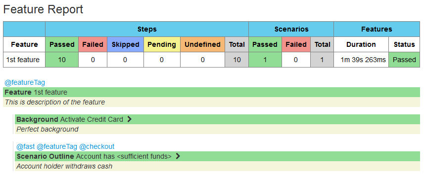
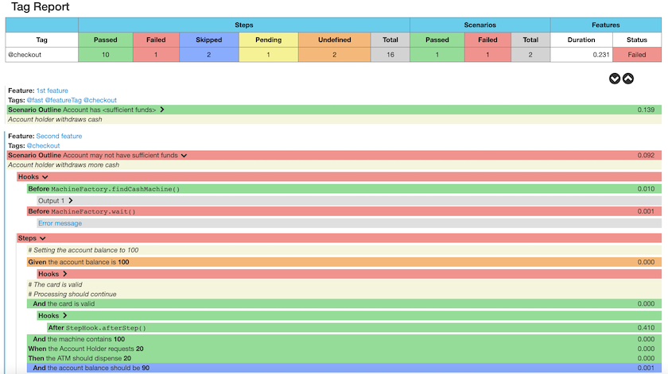

[](https://travis-ci.com/github/damianszczepanik/cucumber-reporting)
[](https://ci.appveyor.com/project/damianszczepanik/cucumber-reporting/history)
[](https://app.shippable.com/projects/5844689c9d1f3e0f0057631a)
[](http://damianszczepanik.github.io/cucumber-html-reports/overview-features.html)

[](https://codecov.io/github/damianszczepanik/cucumber-reporting)
[](https://sonarcloud.io/dashboard?id=damianszczepanik_cucumber-reporting)
[](https://www.codacy.com/app/damianszczepanik/cucumber-reporting)
[](https://codebeat.co/projects/github-com-damianszczepanik-cucumber-reporting)
[](https://snyk.io/org/damianszczepanik/project/6a2fe301-d56c-49e7-8c78-cd3ff09c3828)

[](http://search.maven.org/#search|gav|1|g%3A%22net.masterthought%22%20AND%20a%3A%22cucumber-reporting%22)
[](https://raw.githubusercontent.com/damianszczepanik/cucumber-reporting/master/LICENCE)
[](https://github.com/damianszczepanik/cucumber-reporting/graphs/contributors)

# Publish pretty [cucumber](https://cucumber.io/) reports

This is a Java report publisher primarily created to publish cucumber reports on the Jenkins build server.
It publishes pretty html reports with charts showing the results of cucumber runs. It has been split out into a standalone package so it can be used for Jenkins and maven command line as well as any other packaging that might be useful. Generated report has no dependency so can be viewed offline.

## Background

Cucumber is a test automation tool following the principles of Behavioural Driven Design and living documentation. Specifications are written in a concise human readable form and executed in continuous integration.

This project allows you to publish the results of a cucumber run as pretty html reports. In order for this to work you must generate a cucumber json report. The project converts the json report into an overview html linking to separate feature files with stats and results.

## Install

Add a maven dependency to your pom
```xml
<dependency>
    <groupId>net.masterthought</groupId>
    <artifactId>cucumber-reporting</artifactId>
    <version>(check version above)</version>
</dependency>
```

Read this if you need further [detailed configuration](https://github.com/jenkinsci/cucumber-reports-plugin/wiki/Detailed-Configuration) instructions for using the Jenkins version of this project

## Usage
```Java
File reportOutputDirectory = new File("target");
List<String> jsonFiles = new ArrayList<>();
jsonFiles.add("cucumber-report-1.json");
jsonFiles.add("cucumber-report-2.json");

String buildNumber = "1";
String projectName = "cucumberProject";

Configuration configuration = new Configuration(reportOutputDirectory, projectName);
// optional configuration - check javadoc for details
configuration.addPresentationModes(PresentationMode.RUN_WITH_JENKINS);
// do not make scenario failed when step has status SKIPPED
configuration.setNotFailingStatuses(Collections.singleton(Status.SKIPPED));
configuration.setBuildNumber(buildNumber);
// addidtional metadata presented on main page
configuration.addClassifications("Platform", "Windows");
configuration.addClassifications("Browser", "Firefox");
configuration.addClassifications("Branch", "release/1.0");

// optionally add metadata presented on main page via properties file
List<String> classificationFiles = new ArrayList<>();
classificationFiles.add("properties-1.properties");
classificationFiles.add("properties-2.properties");
configuration.addClassificationFiles(classificationFiles);

// optionally specify qualifiers for each of the report json files
        configuration.addPresentationModes(PresentationMode.PARALLEL_TESTING);
        configuration.setQualifier("cucumber-report-1","First report");
        configuration.setQualifier("cucumber-report-2","Second report");

        ReportBuilder reportBuilder=new ReportBuilder(jsonFiles,configuration);
        Reportable result=reportBuilder.generateReports();
// and here validate 'result' to decide what to do if report has failed
```
There is a feature overview page:


And there are also feature specific results pages:



And useful information for failures:


If you have tags in your cucumber features you can see a tag overview:


And you can drill down into tag specific reports:




## Continuous delivery and live demo

You can play with the [live demo](http://damianszczepanik.github.io/cucumber-html-reports/overview-features.html) report before you decide if this is worth to use. Report is generated every time new change is merged into the main development branch so it always refers to the most recent version of this project. Sample configuration is provided by [sample code](./src/test/java/LiveDemoTest.java).

## Code quality

Once you developed your new feature or improvement you should test it by providing several unit or integration tests.


## Contribution

Interested in contributing to the cucumber-reporting?  Great!  Start [here](https://github.com/damianszczepanik/cucumber-reporting).
